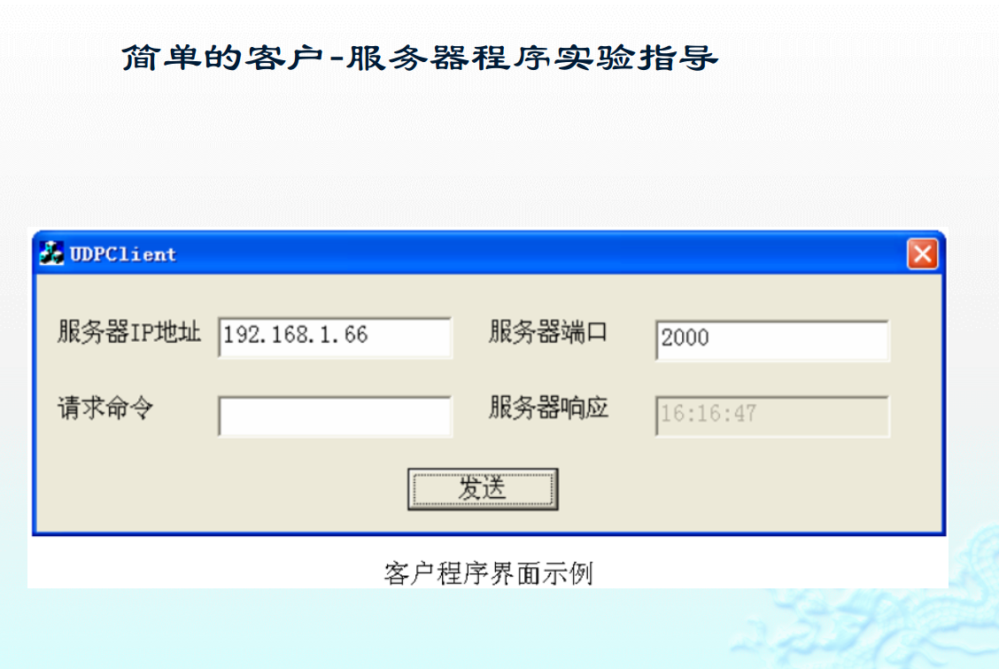
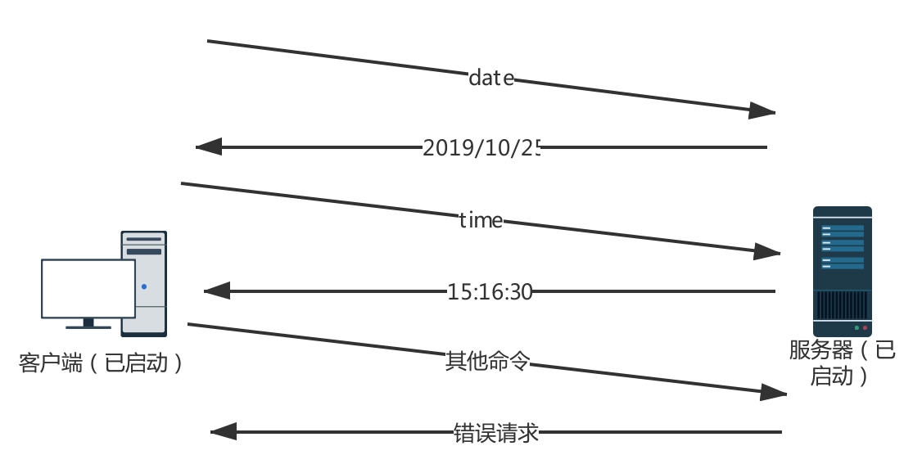
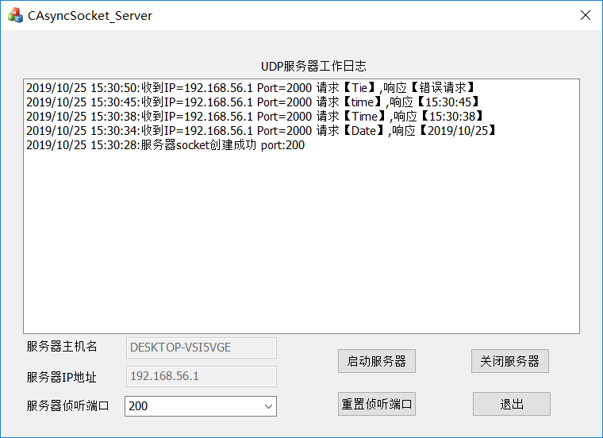
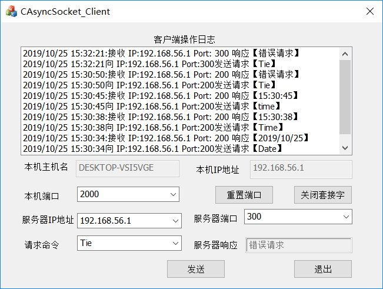
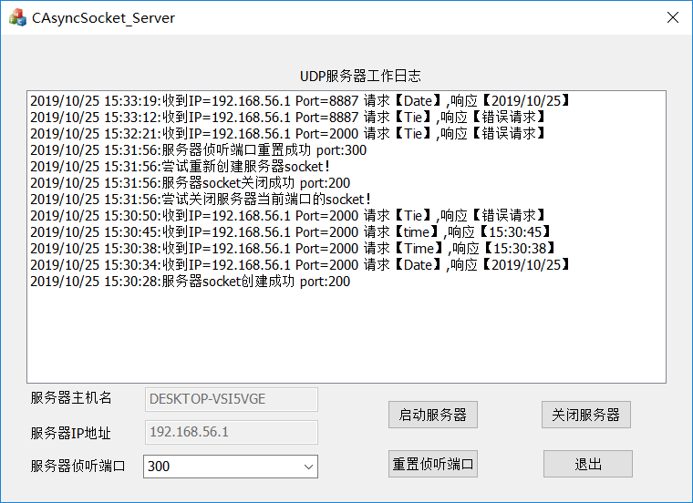
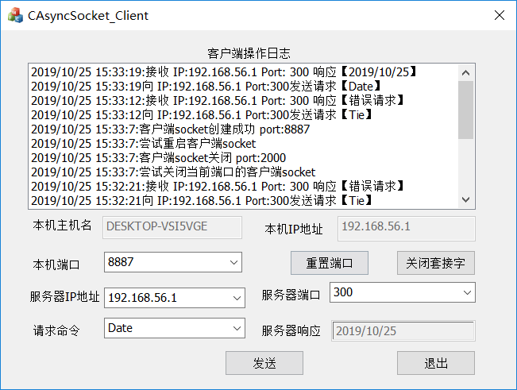
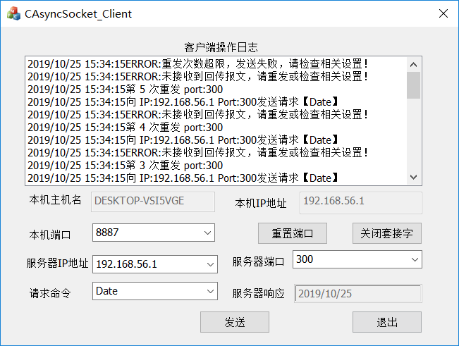

# 实验一——套接字网络编程

> [jack-lio](https://github.com/Jack-Lio) 最新更新于2019年10月25日

## 一、 实验要求
本实验要求通过编写程序实现客户端应用和服务器端应用的网络通信，利用`CAsyncSocket`类编写基于UDP协议的简单客户-服务器程序，服务器收到客户发来的“Time”或者“Date”请求后利用本地时间和日期分别进行响应。


服务器端的基本功能是显示工作日志，包括客户端的地址以及端口号以及请求命令类型，同时显示服务器端返回的结果是什么。


客户端的基本功能是选择输入服务器的IP地址和接收端口号，同时输入发送的命令，显示服务器返回的结果，在设定好命令和IP后点击发送给服务器端发送报文。



## 二、实验环境说明
实验编译器环境为VS 2015，系统环境为windows 10 专业版，使用的核心库为`CAsyncSocket`套接字类。

## 三、程序功能设计
本客户-服务器端应用层协议分成两个部分，以下部分从客户端和服务器端分别进行功能说明和界面设计说明：

- 客户端：
  
    - 功能设计:
        - 客户端可以向指定的IP地址和端口发送不区分大小写的字符串命令，当命令为“date”或者“time”，服务器端会返回服务器端的本地日期或时间，如果为其他命令，将返回“错误请求”的响应。
        - 客户端能够重新设置本机的套接字绑定端口，并且在本机IP地址栏能够显示本机IP地址，方便进行程序校验和完善程序体验。
        - 客户端日志窗口记录操作日志，对操作做出记录和反馈，完善程序功能。
  - 界面设计：
    - 程序打开界面如上图所示，主要分为三个区域——日志区、客户端状态显示区、操作区。
    - 所有命令输入栏均采用comb box 实现，能够在确定输入后记录历史输入，方便程序的实际操作。

- 服务器端：

  - 功能设计：
    - 服务器端能够接收客户端发送的报文并进行解析，当命令为“date”或者“time”，服务器端会返回服务器端的本地日期或时间，如果为其他命令，将返回“错误请求”的响应。
    - 服务器端能够重新设置本机的套接字绑定端口，启动和关闭服务器端的服务，并且在本机IP地址栏能够显示本机IP地址，方便进行程序校验和完善程序体验。
    - 服务器日志窗口记录工作日志，对操作做出记录和反馈，完善程序功能。
  - 界面设计：
    - 程序界面主要分为三个区域——日志区、状态显示窗口、操作按钮区。
  
- 服务器-客户端网络通信应用层协议说明：

  - 请求响应过程说明：
	
  - 超时重发示意图（本程序设置的超时时间为200ms，可在源代码中修改这一数值）：
  	


## 四、 实验实现功能效果 
- 发送接收基本功能程序演示（包含错误请求和正确请求的测试）：


- 服务器端重置绑定端口演示：


- 客户端重置绑定端口演示：


- 客户端超时重发演示：



## 五、 程序设计思路
### 1、 客户端：
​	客户端首先编写界面对话框样式和交互，主要代码在CAsyncSocket_ClientDlg.cpp文件中，首先创建好相关的控件，并设置好对应的控件变量，然后通过继承CAsyncSocket类编写自定义的Client_Socket类，此类中重载了OnReceive函数，当绑定端口获得来自服务器的数据之后，会自动调用相关响应代码响应数据包，并将响应的数据传回主线程Dlg中进行显示。发送命令，通过对发送按钮的单击消息函数进行编写，在其中通过sendto函数向指定的服务器端口发送请求命令。
​	客户端发送请求命令之后会在计时器的设定时间内等待服务器的数据响应，如果在等待时间内未获得响应，将会自动重新发送命令，如果达到重发命令的上限，将会显示请求失败的日志记录。

1. 程序初始化设定
	- 默认创建client_Socket 类对象
	- 进行界面相关参数的默认值设定
```c++
//BOOL CCAsyncSocket_ClientDlg::OnInitDialog() 函数中代码
	// TODO: 在此添加额外的初始化代码
	BOOL bFlag = Client.Create(_ttoi(m_client_port), SOCK_DGRAM, FD_READ|FD_WRITE);   //创建客户端套接字
	if (!bFlag)								 //错误处理
	{
		MessageBox(L"客户端Socket创建错误，请检查端口使用情况！");
		command_log_ctrl.InsertString(0, getDateTime() + L":客户端socket创建失败");
	}
	else
	{
		command_log_ctrl.InsertString(0, getDateTime() + L":客户端socket创建成功 port:" + m_client_port);
	}
```

``` c++
CCAsyncSocket_ClientDlg::CCAsyncSocket_ClientDlg(CWnd* pParent /*=NULL*/)
	: CDialogEx(IDD_CASYNCSOCKET_CLIENT_DIALOG, pParent)
	, IP_m(_T("192.168.56.1"))
	, port_m(_T("200"))
	, command_m(_T("Date"))
	, response_m(_T(""))
	, resend_count(0)
	, resend_limit(5)
{
	m_hIcon = AfxGetApp()->LoadIcon(IDR_MAINFRAME);
	m_client_port = L"2000";					 //客户端端口号
	char temp[256];
	gethostname(temp,256);      //获取客户主机名
	hostent* host = gethostbyname(temp); //客户主机IP
	m_host_name = temp;
	m_client_address = inet_ntoa(*(struct in_addr *)host->h_addr_list[0]);   //客户端IP地址转为字符串类型
}
```
2. 发送请求按钮响应函数
   - 调用mysend发送消息
   - 将输入命令进行记录
```C++

void CCAsyncSocket_ClientDlg::OnBnClickedOk()
{
	// TODO: 在此添加控件通知处理程序代码
	if (Client == INVALID_SOCKET)		//套接字处于关闭状态不能发送报文，提供报错
	{
		command_log_ctrl.InsertString(0, getDateTime() + L":客户端已经关闭，请启动客户端后重新发送");
		return;
	}

	UpdateData(true);
	//设置时钟进行计时 ，200ms重发一次，可以修改这一参数，调节超时的时间限制
	SetTimer(1, 200, NULL);         
	my_send();                //发送请求报文，调用封装好的发送处理函数

	//以下将新添加的命令或参数记录进comb box 中
	if (IP_ctrl.FindString(0, IP_m) == CB_ERR)
	{
		IP_ctrl.AddString(IP_m);
	}
	if (command_ctrl.FindString(0, command_m)== CB_ERR)
	{
		command_ctrl.AddString(command_m);
	}
	if (port_ctrl.FindString(0, port_m) == CB_ERR)
	{
		port_ctrl.AddString(port_m);
	}
	UpdateData(false);
}
// 发送报文函数
LRESULT  CCAsyncSocket_ClientDlg::my_send(WPARAM wParam, LPARAM lParam)     //封装了发送报文的操作
{
	int flag = Client.SendTo(command_m.GetBuffer(), command_m.GetLength()*sizeof(TCHAR), _ttoi(port_m), IP_m);   //返回值为发送的字符串字节长度
	if (flag == -1) {
		//MessageBox(L"ERROR:发送报文出错，请检查套接字设置！");
		command_log_ctrl.InsertString(0, getDateTime() + L"ERROR:发送报文出错，请检查套接字设置！");
	}
	else {
		command_log_ctrl.InsertString(0, getDateTime() + L"向 IP:" + IP_m + L" Port:" + port_m + L"发送请求【" + command_m + L"】");
	}
	return false;
}
```
3. 重置套接字请求响应函数
   - 根据输入的端口号，重置套接字
```C++
void CCAsyncSocket_ClientDlg::OnBnClickedButton1()			//重置当前的socket设置
{
	// TODO: 在此添加控件通知处理程序代码
	command_log_ctrl.InsertString(0, getDateTime() + L":尝试关闭当前端口的客户端socket");
	OnBnClickedButton2();	         //先调用关闭socket函数
	UpdateData(true);
	if (m_client_port_ctrl.FindString(0, m_client_port) == CB_ERR)   //如果设置了新的端口号，记入进combox中去
	{
		m_client_port_ctrl.AddString(m_client_port);
	}
	command_log_ctrl.InsertString(0, getDateTime() + L":尝试重启客户端socket");
	BOOL bFlag = Client.Create(_ttoi(m_client_port), SOCK_DGRAM, FD_READ | FD_WRITE);   //创建客户端套接字
	if (!bFlag)   //错误处理
	{
		MessageBox(L"客户端Socket创建错误，请检查端口使用情况！");
		command_log_ctrl.InsertString(0, getDateTime() + L":客户端socket创建失败");
	}
	else
	{
		command_log_ctrl.InsertString(0, getDateTime() + L":客户端socket创建成功 port:" + m_client_port);
	}
}

```
4. 关闭套接字请求响应函数
   - 关闭现有套接字
```C++
void CCAsyncSocket_ClientDlg::OnBnClickedButton2()			// 关闭单当前的socket
{
	// TODO: 在此添加控件通知处理程序代码
	if (Client != INVALID_SOCKET)     //判断套接字是否已经关闭   
	{
		Client.Close();
		command_log_ctrl.InsertString(0, getDateTime() + L":客户端socket关闭 port:" + m_client_port);
	}
	else
	{
		command_log_ctrl.InsertString(0, getDateTime() + L":客户端socket已经关闭" );
	}
}
```
5. 超时重发计时器消息响应函数
   - 通过在第一次发送之后设定一个计时器，如果指定时间内没有收到数据，继续重发，当重发次数超限或者onreceive函数收到数据报，将会关闭计时器。
```c++

void CCAsyncSocket_ClientDlg::OnTimer(UINT_PTR nIDEvent)   // 超时重发的主要操作实现函数，基于计时器实现
{
	// TODO: 在此添加消息处理程序代码和/或调用默认值
	if (resend_count >= resend_limit)		//超过一定重发次数，停止重发，关闭计时器
	{
		KillTimer(1);
		resend_count = 0;
		command_log_ctrl.InsertString(0, getDateTime() + L"ERROR:重发次数超限，发送失败，请检查相关设置！");
	}
	else {
		my_send();    //重发消息
		resend_count++;   //重发次数增加
		CString str; str.Format(L"第 %d 次重发 port:",resend_count);
		command_log_ctrl.InsertString(0, getDateTime() + str + port_m);
	}
	CDialogEx::OnTimer(nIDEvent);
}
```
6. 接收服务器数据包响应
   - 调用receivefrom函数接收服务器数据报响应
   - 通过获取主窗口句柄将数据传回主窗口显示
```C++
void Client_Socket::OnReceive(int nErrorCode)
{
	// TODO: 在此添加专用代码和/或调用基类
	CCAsyncSocket_ClientDlg* pDlg = (CCAsyncSocket_ClientDlg*)(AfxGetApp()->GetMainWnd());
	TCHAR  lBuffer[4096](L"");
	CString Server_IP;
	UINT Server_Port;
	int m_length = sizeof(lBuffer);
	m_length = ReceiveFrom(lBuffer, m_length, Server_IP, Server_Port, 0);
	if (m_length != -1)
	{
		pDlg->response_m = lBuffer;
		pDlg->UpdateData(false);
		pDlg->KillTimer(1);		//成功接收消息，关闭计时器
		pDlg->resend_count = 0;	//重置重发计数器为0
		CString str;
		str.Format(L":接收 IP:%s Port: %d 响应【%s】" , Server_IP  , Server_Port , lBuffer );
		pDlg->command_log_ctrl.InsertString(0, pDlg->getDateTime() + str);
	}
	else
	{
		pDlg->command_log_ctrl.InsertString(0, pDlg->getDateTime() + L"ERROR:未接收到回传报文，请重发或检查相关设置！");
	}
	CAsyncSocket::OnReceive(nErrorCode);
}
```
### 2、服务器端：

​	服务器端主要也是包括界面设计和数据报收发，通过继承`CAsyncSocket`类编写自定义类`Server_Socket`，并重载其虚函数`OnReceive()`，服务器在`OnReceive`函数中调用`receivefrom`函数获取来自设定端口的数据报，并进行解析后针对正确请求返回响应的数据，即通过`SendTo`函数将响应数据发送回请求客户端的相应端口。因服务器端主界面设计和客户端主界面设计区别不大，因此在这里只主要对服务器数据收发的代码进行展示描述。***注意：服务器端的socket创建在创建套接字的按钮响应函数中实现***

1. 默认数据初始化代码：
   - 初始化响应的默认数据
   - 获取本机IP地址和主机名
```C++
CCAsyncSocket_ServerDlg::CCAsyncSocket_ServerDlg(CWnd* pParent /*=NULL*/)
	: CDialogEx(IDD_CASYNCSOCKET_SERVER_DIALOG, pParent)
	, server_port(_T("200"))
{
	m_hIcon = AfxGetApp()->LoadIcon(IDR_MAINFRAME);
	char temp[256];
	gethostname(temp, 256);      //获取客户主机名
	hostent* host = gethostbyname(temp); //客户主机IP
	server_hostname = temp;
	server_address = inet_ntoa(*(struct in_addr *)host->h_addr_list[0]);   //客户端IP地址转为字符串类型
}
```
2. 服务器数据请求响应函数
   - 接收设定端口上的客户端请求数据报
   - 解析数据报请求命令，并判断命令是否正确
   - 针对正确命令返回相应的结果，错误请求返回“错误请求”提示
   - 通过`sendto`函数将响应结果发回客户端
   - 通过主界面句柄将日志信息输出到主界面展示窗口中去
```C++
void Server_Socket::OnReceive(int nErrorCode)
{
	// TODO: 在此添加专用代码和/或调用基类
	TCHAR lBuffer[4096](L"");   //这里需要进行初始化，否则会报
	int m_length = sizeof(lBuffer);        // 缓冲区的长度 
	CString Client_IP ;						//IP地址
	UINT Client_port;						// 端口号
	// 获取对话框句柄
	CCAsyncSocket_ServerDlg* pDlg  = (CCAsyncSocket_ServerDlg*)(AfxGetApp()->GetMainWnd());
	// 获取报文,返回值为接收报文的长度
	m_length = ReceiveFrom(lBuffer , 8192, Client_IP, Client_port, 0);
	//获取日期时间并转为字符串形式
	CString log;
	CTime tm; tm = CTime::GetCurrentTime();
	CString date, time;
	date.Format(L"%d/%d/%d", tm.GetYear(), tm.GetMonth(), tm.GetDay());
	time.Format(L"%d:%d:%d", tm.GetHour(), tm.GetMinute(), tm.GetSecond());
	
	if (m_length!=-1)		// 错误处理
	{
		CString command = CString(lBuffer).MakeLower();
		CString response; 
		if (command == L"date")
		{
			response=date;
		}
		else if (command == L"time")
		{
			response = time;
		}
		else
		{
			response.Format(L"错误请求");
		}
		// 以下代码回传响应结果，并且判断回传是否成功，如果不成功，解记录错误日志
		if (SendTo(response.GetBuffer(),
			response.GetLength()*sizeof(TCHAR),
			Client_port,
			Client_IP))
		{
			log.Format(L"%s %s:收到IP=%s Port=%d 请求【%s】,响应【%s】", date, time, Client_IP, Client_port, lBuffer, response);
		}
		else
			log.Format(L"ERROR：【消息回传错误】%s %s:收到IP=%s Port=%d 请求【%s】,响应【%s】", date, time, Client_IP, Client_port, lBuffer, response);
		pDlg->list_ctrl.InsertString(0, log);
	}
	else
	{
		pDlg->MessageBox(L"接收报文出现错误！");
		log.Format(L"ERROR：【接收报文错误】%s %s:收到IP=  Port=   请求【】,响应【】", date, time);
		pDlg->list_ctrl.InsertString(0, log);
	}
	CAsyncSocket::OnReceive(nErrorCode);
}
```


##  六、  实验总结

​	本次实验通过对客户端-服务器端数据报收发的程序编写，我对TCP/IP协议的理解更加深入，了解了基本的MFC网络编程的相关知识，在编写完成程序之后自己也很有成就感，对于IP地址和端口绑定的意义和作用也有了简单的了解。

​	在本次的实验中，因为不太熟悉MFC相关变量的特定以及网络通信函数中的变量类型，在编写数据报收发的过程中一直不能够正常的实现数据报收发，后来才发现是`SendTo`函数的参数变量类型有问题，但是编译器一直没有报错，所以查了很久才查到这个错误。

​	总结而言，这次的实验使我对于在课堂上学习到的TCP/IP协议和数据报发送接收的流程有了更全面深入的理解和运用，感觉自己在编程能力和知识上都有了一点进步。